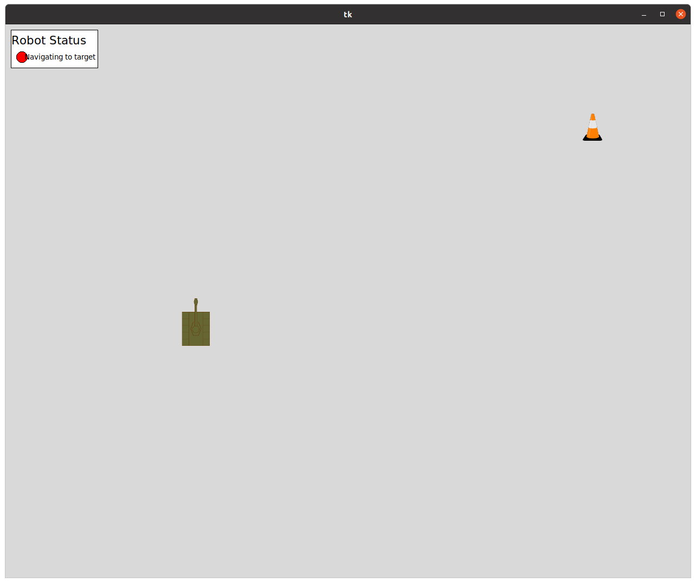

# WRoverPlayground

Welcome to WRoverPlayground! These learning modules will help you become somewhat proficient in using the Robot Operating System (ROS). Each module builds on the previous ones. When you are finished, you will have built software for a robot named WRunt. This robot will be able to autonomously navigate through a course of infrared (IR) beacons from a starting location.



Your software will allow WRunt to detect beacons and navigate between them. The only instructions that can be given to WRunt during operation are to tell it to go to the next beacon in the course. Once a beacon is reached WRunt will let us know that it has arrived by lighting up its status light. Below are more detailed descriptions of how WRunt will be controlled using ROS. Don't worry if this doesn't make sense now! The modules will walk you through this step by step.

## WRunt specifications

### Drive system

WRunt will have two drive wheels. The drive system used is called a tank drive. This means that each side of the robot is controlled independently. When both sides are commanded to go forward, the robot will move forward. When one side is commanded forward and the other backward, the robot spins. You can get creative with this and put one side at a slightly lower power to move the robot on a curve.

### Infrared (IR) sensor

The IR sensor detect IR radiation from the closest beacon and gives you the heading of the closest beacon relative to the robot. You'll need to use this information to figure out where to drive WRunt.

### Status light

The status light lights up when WRunt has reached the target. This allows observers to know when WRunt knows it has reached its target. During a competition setting, this lets the judges know that the robot actually completed the task and did not just accidentally get to the right spot.

### Continue to next beacon signal

Once WRunt has reached the first beacon, you will need to give it a manual signal that it can move on to the next beacon. In real life, this signal would be transmitted over a network connection. For our pursposes, it will be a button on a Graphical User Interface (GUI).

## WRunt behavior flowchart

1. WRunt determines the closest beacon that hasn't been visited yet
2. WRunt move to and reaches the target beacon
3. WRunt marks the beacon as visited, changes its own status light, and awaits a certain number of seconds
4. Repeat steps 1-3 until all beacons have been reached

## How To Open The Project

This project uses git and GitHub for version control.
If you are new to using git or need a refesher you can check out https://learngitbranching.js.org.
We recommend doing the "Introduction Sequence" in the Main section and "Push & Pull -- Git Remotes!" in the Remote section.

To set up SSH keys, refer to the following GitHub documentation pages:
* https://docs.github.com/en/authentication/connecting-to-github-with-ssh/generating-a-new-ssh-key-and-adding-it-to-the-ssh-agent
* https://docs.github.com/en/authentication/connecting-to-github-with-ssh/adding-a-new-ssh-key-to-your-github-account

This project uses Docker to efficiently containerize the workspace and make cross-platform development easier.
The first time you launch the workspace Docker container, it may take a few minutes for Docker to download the ROS Docker image and project dependencies.

Find your host platform below to see how to start development:

### Linux

#### Tools:

* [git](https://git-scm.com/)
* [VS Code](https://code.visualstudio.com/)
* [Docker Engine](https://docs.docker.com/engine/)

#### Instructions:

These instructions are written for Ubuntu, steps may vary if using a different distribution.

1. Install git: `sudo apt install git`
2. Install VS Code: https://code.visualstudio.com/docs/setup/linux
3. Install Docker: https://docs.docker.com/engine/install/ubuntu/
4. Set up SSH keys
5. Clone the repository
6. Open the repository with VSCode
7. In VSCode's command palette (F1), run `Dev Containers: Open Folder in Container`

#### Troubleshooting:

**NOTE**: Please do not commit [`devcontainer.json`](./.devcontainer/devcontainer.json) if you need to modify it according to the following troubleshooting steps.

1. After trying to run a GUI app, the following error is encountered: `Authorization required, but no authorization protocol specified`.
To fix this, try `xhost +localhost`, and see if the issue is resolved. If not, run `xhost +`.
Since these command allow connections to your local X server, you may want to revert them with the corresponding `xhost -localhost` or `xhost -` after you are done using the devcontainer.
2. After opening the devcontainer, a SELinux AVC denial is encountered. The workaround is running `chcon -Rt svirt_sandbox_file_t /path/to/WRoverPlayground`. Documented here: https://github.com/microsoft/vscode-remote-release/issues/1333
3. After trying to run a GUI app, a SELinux AVC denial is encountered. To fix this, add `"--security-opt=label=type:container_runtime_t"` to the `runArgs` in [`devcontainer.json`](./.devcontainer/devcontainer.json).
3. If you are using podman, you will need to add `"--userns=keep-id"`  to the `runArgs` in [`devcontainer.json`](./.devcontainer/devcontainer.json). Podman is not officially supported.

### Windows

#### Tools:

* [git](https://git-scm.com/)
* [VS Code](https://code.visualstudio.com/)
* [WSL 2](https://www.omgubuntu.co.uk/how-to-install-wsl2-on-windows-10)
* [Docker Desktop](https://www.docker.com/products/docker-desktop/)

#### Instructions:

1. Install tools
2. Set up SSH keys on Windows and in WSL
3. Clone the repository inside WSL
4. Open the repository with VSCode
5. Launch Docker Desktop
6. In VSCode's command palette (F1), run `Dev Containers: Open Folder in Container`

#### Troubleshooting:

Unable to execute git push or pull in container: https://superuser.com/questions/1726204/get-agent-identities-ssh-agent-bind-hostkey-communication-with-agent-failed

### Mac

#### Tools:

* [git](https://git-scm.com/)
* [VS Code](https://code.visualstudio.com/)
* [XQuartz](https://www.xquartz.org/)
* [Docker Desktop](https://www.docker.com/products/docker-desktop/)

#### Instructions:

1. Install tools (beware that install XQuartz requires a logout/login, so save any local changes on your computer before installing XQuartz)
2. Set up SSH keys
3. Clone the repository
4. Open the repository with VSCode
5. Launch Docker Desktop
6. In VSCode's command palette (F1), run `Dev Containers: Open Folder in Container`

To ensure docker works with GUI tools, run `roscore` in VSCode's terminal and `rqt_plot` in another terminal. Follow instructions below if a new window fails to start and the terminal outputs something similar to:
```
could not connect to display 
This application failed to start because no Qt platform plugin could be initialized. Reinstalling the application may fix this problem.

Available platform plugins are: eglfs, linuxfb, minimal, minimalegl, offscreen, vnc, xcb.
```
1. Start XQuartz with `open -a XQuartz`
2. Under the security section of settings, check "Allow connections from network clients"
3. Restart your Mac and start XQuartz again
4. Ensure that XQuartz is running correctly with `ps aux | grep Xquartz`. There should be a line that is similar to `/opt/X11/bin/Xquartz :0 -listen tcp`. Make sure it is not `–nolisten tcp`.
5. Allow X11 forwarding with `xhost +` to allow any client to connect or `xhost +localhost` to limit clients to localhost. Note that `xhost +` is not a persistent setting, so you would have to rerun it every time you restart X11
6. Go back to your docker environment and try running `rqt_plot` again, this time the display should show. 

#### Troubleshooting:

Unable to display `rqt` tools or other graphics: https://gist.github.com/sorny/969fe55d85c9b0035b0109a31cbcb088

## Next Steps:
Once you are done with enviorment setup, you are ready to begin the tutorial! Inside the `src` folder you should see modules `debug_training`, `topic_training`, `service_training` and `package_training` (among other modules), each with a markdown file. You should go through the trainings in the following order:
- Debug Training @ [`src/debug_training/ROS_Tools.md`](https://github.com/WisconsinRobotics/WRoverPlayground/blob/master/src/debug_training/ROS_Tools.md)
- Topic Training @ [`src/topic_training/Topic_Training.md`](https://github.com/WisconsinRobotics/WRoverPlayground/blob/master/src/topic_training/Topic_Training.md)
- Service Training @ [`src/service_training/Service_Training.md`](https://github.com/WisconsinRobotics/WRoverPlayground/blob/master/src/service_training/Service_Training.md)
- Package Training @ [`src/package_training/ROS_Setup.md`](https://github.com/WisconsinRobotics/WRoverPlayground/blob/master/src/package_training/ROS_Setup.md)

ROS uses either C++ or Python. If you are unfamiliar with either languages, here are some online resources to help you learn these languages. Feel free to take as much time as you need to go through them.

#### Python:

[The Python Tutorial](https://docs.python.org/3/tutorial/): only need to be familiar with topics up to and including chapter 7 (Input and Output).

[Think Python](https://greenteapress.com/wp/think-python-2e/): only need to be familiar with topics in chapter 2, 3, 5, 6, 7, 10 and 11. 

#### C++:
[Cornell C++ Tutorials](https://www.cs.cornell.edu/courses/cs5152/2022sp/resources/cpp/): only need to be familiar with topics in videos 1-3.