# WRoverPlayground - ROS Tools

This training introduces the following ROS concepts: nodes, topics, services, and the Parameter Server.
Then, it explains how to use ROS command-line and GUI debug tools.
Lastly, roslaunch will be shown as a method for starting multiple nodes together.

The goal of this training is to become familiar with ROS concepts and the following debug tools:
- `rosnode`
- `rostopic`
- `rosservice`
- `rosparam`
- `rqt_graph`
- `rqt_plot`

## ROS Concepts Crash Course

ROS nodes are processes that use ROS to communicate with other nodes.
ROS nodes communicate with each other using streaming topics, RPC services, and the Parameter Server.

ROS topics are named interfaces with a publisher and subscriber model.
Publisher nodes generate data and publish that data to a topic.
Subscriber nodes subscribe to a topic to use data that is published to a topic.
A topic can have multiple publisher and subscriber nodes.
Topics are intended for unidirectional communication.

If a response is expected from a node, a service should be used instead.
ROS services allow nodes to return data to other nodes.
Server nodes define the service request and response.
Client nodes call the service by sending a request and await the response.

Both topics and services are defined using messages.
A message is a data structure containing typed fields.
For a service, a request and a response message must be defined.

ROS topics and services will be covered in more detail in the next training modules.

The final method of communication between ROS nodes is the Parameter Server.
This is essentially a shared dictionary that can be used to store and retrieve variables at runtime.
It is usually used for configuration since it is not designed for high performance.

## ROS Command Line

### Starting nodes

Let's start by running a ROS node.
You can focus on the commands here rather than what the nodes do/contain.

Open a terminal window and run `roscore`.
This starts the ROS master node.

Open a new terminal and run `rosnode list`.
You should see a single node: `/rosout`.

Run `rosnode info /rosout`.
You should see the following output: 
```
Node [/rosout]
Publications: 
 * /rosout_agg [rosgraph_msgs/Log]

Subscriptions: 
 * /rosout [unknown type]

Services: 
 * /rosout/get_loggers
 * /rosout/set_logger_level
```
This shows that the `/rosout` node publishes to the `/rosout_agg` topic and subscribes to the `/rosout` topic.
Also, the `/rosout` node provides the `/rosout/get_loggers` and `/rosout/set_logger_level` services.

Now, let's start another node.
Run `rosrun turtlesim turtlesim_node`.

This starts `turtlesim_node` from the `turtlesim` package.
Packages are how code is organized in a ROS project.
They will be covered further in a later training.
If you get an error `[rospack] Error: package 'turtlesim' not found`, install `turtlesim` by running `sudo apt install ros-noetic-ros-tutorials`.

You should see a GUI window with a turtle in the middle.

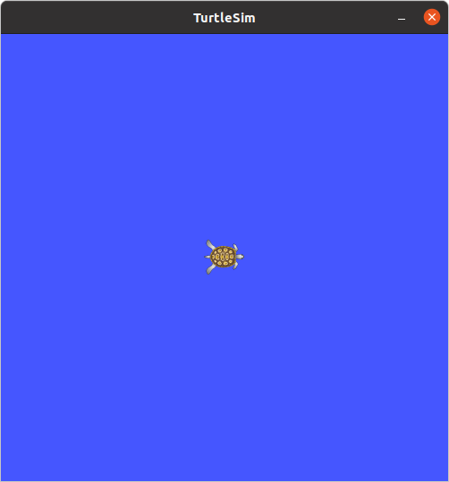

In a new terminal, run `rosnode list`.
You should see the following output: 
```
/rosout
/turtlesim
```

Let's find out more about the `/turtlesim` node.
Run `rosnode info /turtlesim`.
You should see the following output:
```
Node [/turtlesim]
Publications: 
 * /rosout [rosgraph_msgs/Log]
 * /turtle1/color_sensor [turtlesim/Color]
 * /turtle1/pose [turtlesim/Pose]

Subscriptions: 
 * /turtle1/cmd_vel [unknown type]

Services: 
 * /clear
 * /kill
 * /reset
 * /spawn
 * /turtle1/set_pen
 * /turtle1/teleport_absolute
 * /turtle1/teleport_relative
 * /turtlesim/get_loggers
 * /turtlesim/set_logger_level
```

As you can see, the `/turtlesim` node publishes to 3 topics, and subscribes to the `/turtle1/cmd_vel`.
It also provides a set of services.

ROS debug tools allow us to interact with these topics and services without having to write a separate node for debugging.

### Interacting with Topics

Let's see what messages are being published to the `/turtle1/pose` topic.
We can do this by running `rostopic echo /turtle1/pose`.
The terminal should be repeatedly outputting the following:
```
x: 5.544444561004639
y: 5.544444561004639
theta: 0.0
linear_velocity: 0.0
angular_velocity: 0.0
---
```

Let's find out more about the message that is being published.
From the `rosnode info /turtlesim` output, we know that the message type of the `/turtle1/pose` topic is `turtlesim/Pose`.

Run `rosmsg show turtlesim/Pose`.
You should see the following output:
```
float32 x
float32 y
float32 theta
float32 linear_velocity
float32 angular_velocity
```

Now, let's publish to a topic.
Run the command `rostopic pub -1 /turtle1/cmd_vel geometry_msgs/Twist -- '[1.0, 0.0, 0.0]' '[0.0, 0.0, 0.0]'`.
The turtle in the GUI window should move to the right.

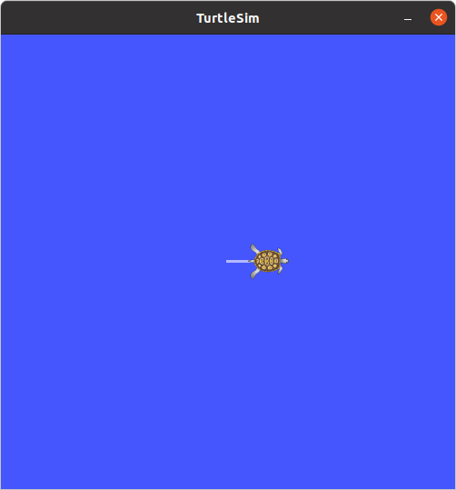

Let's find out more about the `geometry_msgs/Twist` message we just published.
Run `rosmsg show geometry_msgs/Twist`.
You should see the following output:
```
geometry_msgs/Vector3 linear
  float64 x
  float64 y
  float64 z
geometry_msgs/Vector3 angular
  float64 x
  float64 y
  float64 z
```

We can also publish to topics at a specified rate.
Run `rostopic pub /turtle1/cmd_vel geometry_msgs/Twist -r 1 -- '[2.0, 0.0, 0.0]' '[0.0, 0.0, -1.8]'`.
The turtle should be moving in a circle.

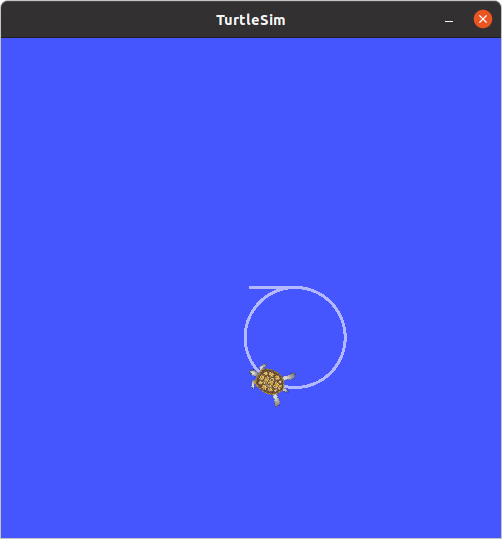

### Interacting with services

Let's call the `/turtle1/teleport_absolute` service.

First, we should find out the service's request and response message types.
Run `rosservice type /turtle1/teleport_absolute`.
This should output `turtlesim/TeleportAbsolute`.
Now, run `rossrv show turtlesim/TeleportAbsolute`.
This should output the following:
```
float32 x
float32 y
float32 theta
---
```
The `---` separates the request message and the response message.
This means the service takes 3 float32 values as the request message and returns an empty response message.

Run `rosservice call /turtle1/teleport_absolute 0.0 0.0 0.0`.
The turtle should be moved to the bottom left of the GUI window.

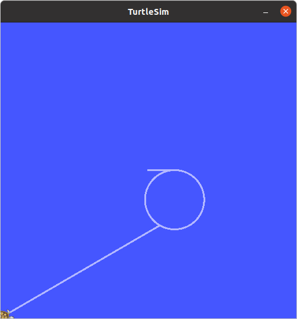

### ROS Parameters

We can see what parameters are currently on the Parameter Server by running `rosparam list`.
This should output the following:
```
/rosdistro
/roslaunch/uris/host_ros_desktop__33381
/rosversion
/run_id
/turtlesim/background_b
/turtlesim/background_g
/turtlesim/background_r
```

Let's get the value of `/turtlesim/background_b` parameter.
Run `rosparam get /turtlesim/background_b`.
This should output `255`.

Now, let's set the value of the `/turtlesim/background_b` parameter to 0.
Run `rosparam set /turtlesim/background_b 0`.
Then, we call the `/clear` service to tell `turtlesim_node` to redraw the background.
Run `rosservice call /clear`.
The background should now be a shade of green.

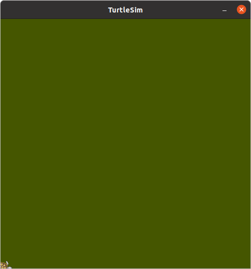

## RQT Tools

ROS also provides GUI tools for debugging.

### rqt_graph

Run `rqt_graph`. This tool lets us visualize the ROS node graph.

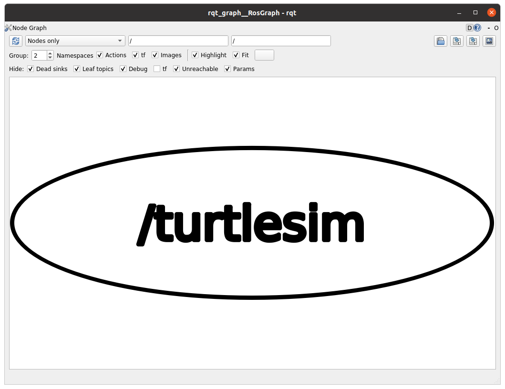

So far, we only have one node running.
Let's start a new node that communicates with `/turtlesim`.
In a new terminal, run `rosrun turtlesim turtle_teleop_key`.
Then, refresh `rqt_graph` by pressing the button in the top left corner.

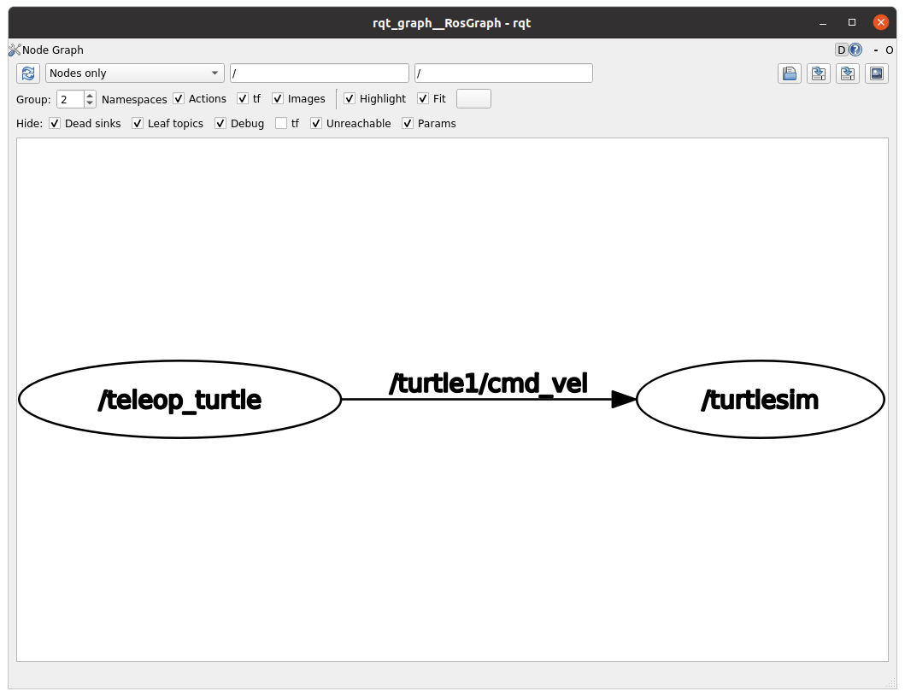

Now, we see a new node, `/teleop_turtle`, which publishes to the `/turtle1/cmd_vel` topic.
As we saw previously, the `/turtlesim` node subscribes to the `/turtle1/cmd_vel` topic.

Let's start another node to listen to the `/turtle1/cmd_vel`.
We can do this by using `rostopic echo`.
In a new terminal, run `rostopicc echo /turtle1/cmd_vel`, and refresh `rqt_graph`.

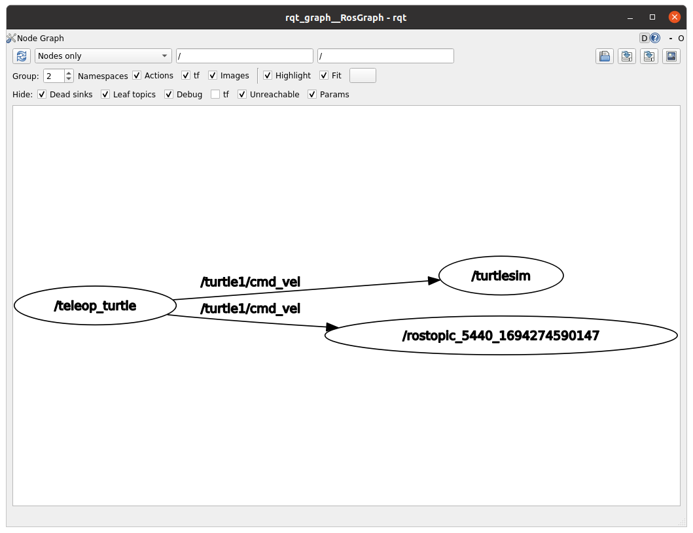

### rqt_plot

Another useful GUI debugging tool is `rqt_plot`.
In a new terminal, run `rqt_plot`.
You may need to resize the window.

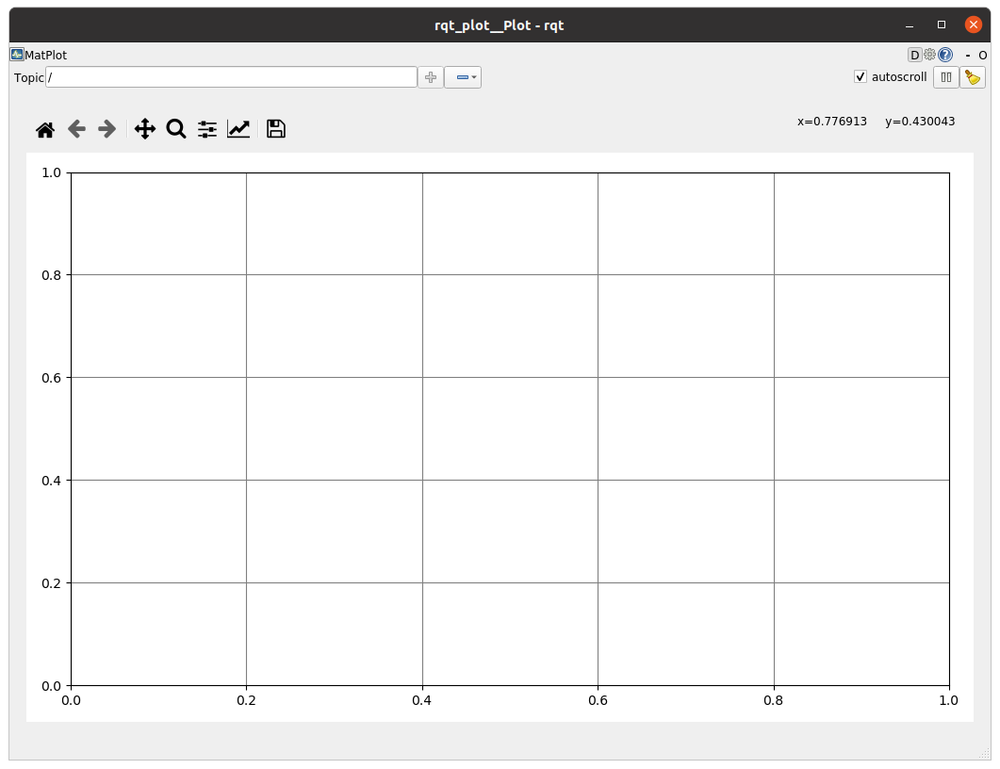

Now, let's graph the turtle's position.
In the "Topic" text box, type `/turtle1/pose/x`, and click the "+" button.
Then, do the same for `/turtle1/pose/y`.

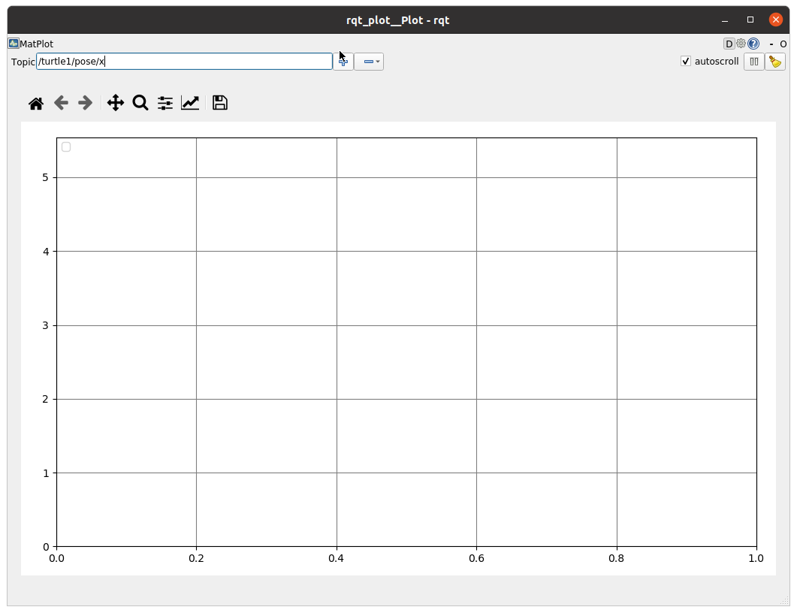

Then, return to the terminal window where you ran `rosrun turtlesim teleop_key`.
Use arrow keys to move the turtle around.
You should see the changes of the x and y positions of the turtle in `rqt_plot`.

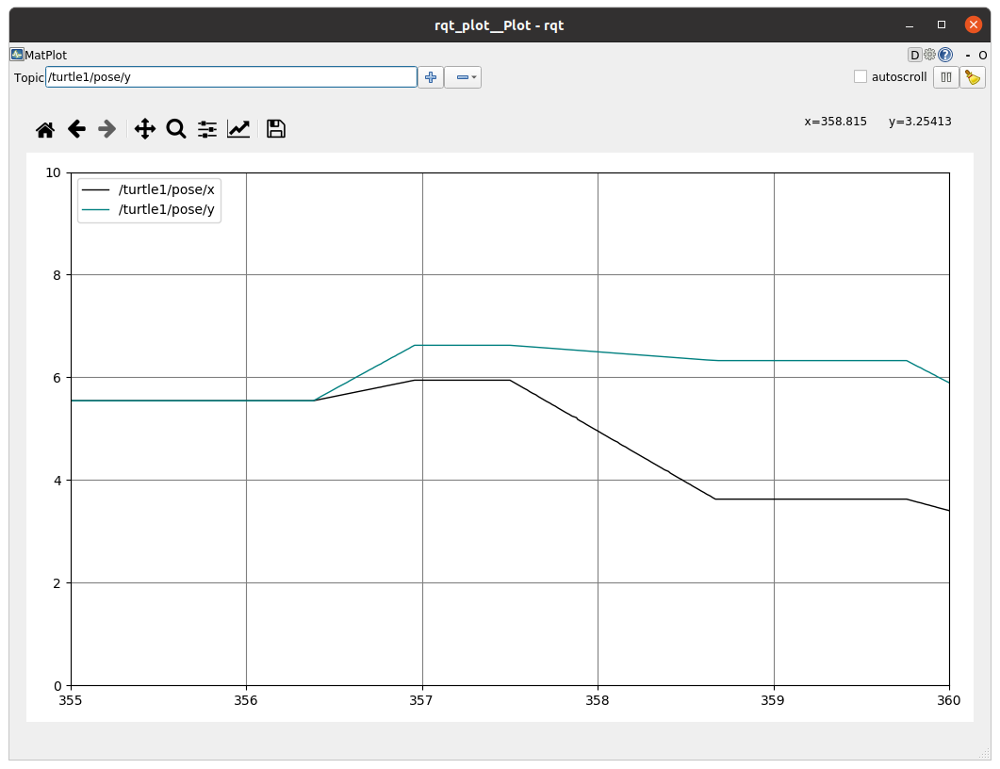

## ROS Launch

In most cases, we are starting up many nodes at once.
It would be tedious to try to start each node individually.
ROS provides `roslaunch` to automatically start `roscore` and start multiple nodes at once.

At this point you can close/kill the ROS services started previously.

Run `roslaunch debug_training turtlemimic.launch`.
You should see 2 turtlesim windows open.

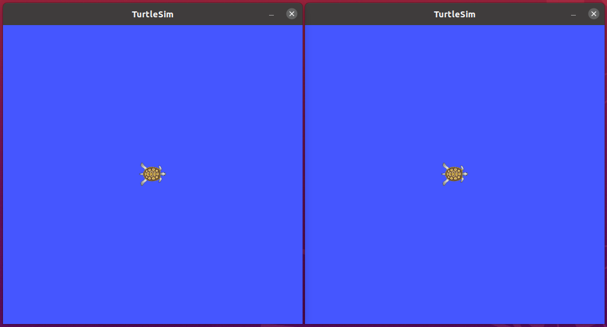

Now, let's look at the launch file: [`turtlemimic.launch`](./launch/turtlemimic.launch)
This is an XML file.

```XML
  <group ns="turtlesim1">
    <node pkg="turtlesim" name="sim" type="turtlesim_node"/>
  </group>

  <group ns="turtlesim2">
    <node pkg="turtlesim" name="sim" type="turtlesim_node"/>
  </group>
```

This section defines two namespaces for the instances of `turtlesim_node`, so we are able to start 2 nodes with the same name.

```XML
  <node pkg="turtlesim" name="mimic" type="mimic">
    <remap from="input" to="turtlesim1/turtle1"/>
    <remap from="output" to="turtlesim2/turtle1"/>
  </node>
```

This section starts a `mimic` node.
This node reads from the `/input` topic and publishes to the `/output` node so that the `/output` mimics `/input`.
The remap tags allow us to change to change the topic that a node is subscribing or publishing to.
In this case, the `/input` topic is mapped to the `/turtlesim1/turtle1` topic, and the `/output` topic is mapped to the `/turtlesim2/turtle1` topic.

We can see this with `rqt_graph`:

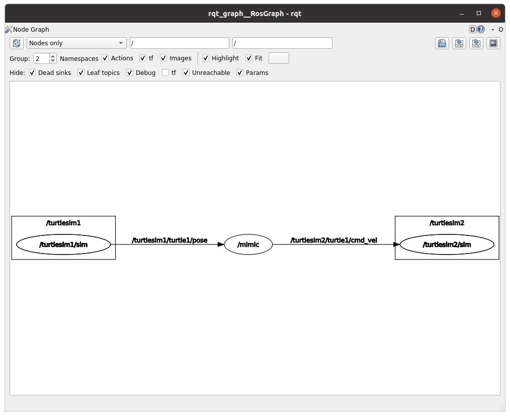

To test the `mimic` node, let's publish to the `/turtlesim1/turtle1/cmd_vel` topic.
In a new terminal, run `rostopic pub /turtlesim1/turtle1/cmd_vel geometry_msgs/Twist -r 1 -- '[2.0, 0.0, 0.0]' '[0.0, 0.0, -1.8]'`.
Both turtles should move in a circle.

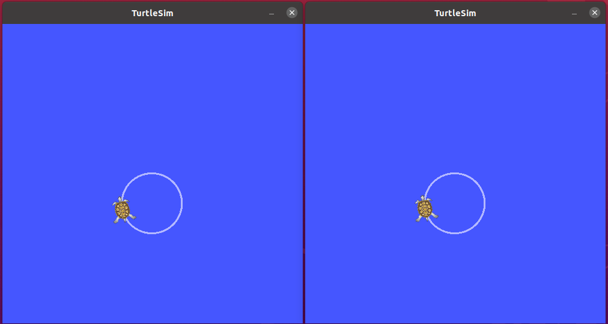

## References

https://wiki.ros.org/ROS/Tutorials/UnderstandingNodes

https://wiki.ros.org/ROS/Tutorials/UnderstandingTopics

https://wiki.ros.org/ROS/Tutorials/UnderstandingServicesParams

https://wiki.ros.org/ROS/Tutorials/UsingRqtconsoleRoslaunch

https://wiki.ros.org/Nodes

https://wiki.ros.org/Topics

https://wiki.ros.org/Services

https://wiki.ros.org/Parameter%20Server

https://wiki.ros.org/rqt_graph

https://wiki.ros.org/rqt_plot

https://wiki.ros.org/rqt_console

https://wiki.ros.org/roslaunch
